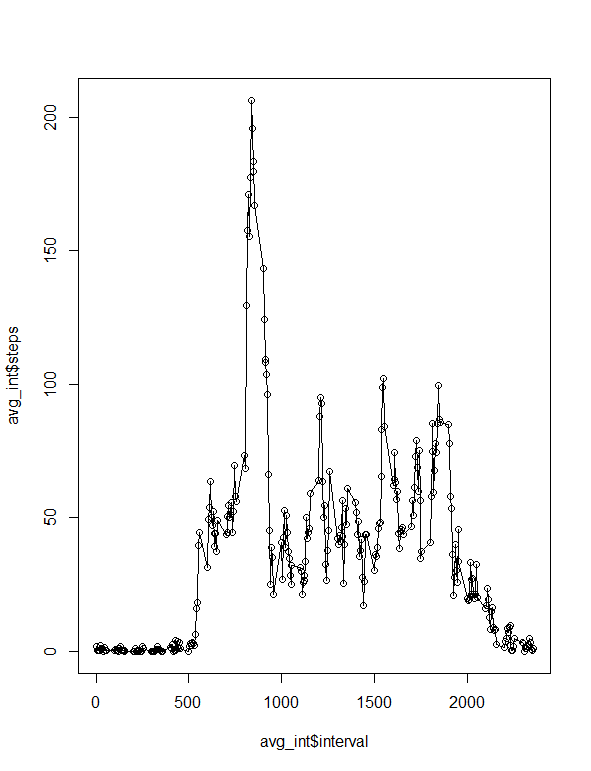

# Reproducible Researh

```echo=TRUE

library(knitr)

library(ggplot2)
```

# Load in Data
```echo=TRUE
Act_data <- read.csv("C:\\Users\\aabdulkhalek\\Documents\\Test\\Reproducible Research\\activity.csv",colClasses=c("integer", "Date","integer"))
```

# Remove NAs and calculate the total steps by date
```echo=TRUE
Act_data1 <- na.omit(Act_data)
Act_sum <- aggregate(steps ~ date, Act_data1,sum)
names(Act_sum)[2]<-"Total_Steps"
```

# Histogram of total steps
```echo=TRUE
plot1 <- hist(Act_sum$Total_Steps, col="red",main="Total Number of Steps by Day",xlab="# of Steps",ylab="Freq",breaks=10)
```
 
# Calculate mean and median
```echo=TRUE
avg <- mean(Act_sum$Total_Steps)

medn <- median(Act_sum$Total_Steps)
```

# Calculate mean by interval and graph
```echo=TRUE
avg_int <- aggregate(steps ~ interval, Act_data1,mean)

plot2 <- plot( x= avg_int$interval,y= avg_int$steps, type ="o")
```
 
# calculate max
```echo=TRUE
mx <- avg_int[avg_int$steps == max(avg_int$steps),]
```

# calculate # of NAs
```echo=TRUE
N_nas<-nrow(Act_data)-nrow(Act_data1)
```

# Merge in averges by interval to replace NAs
```echo=TRUE
Edit_data1 <- merge(Act_data,avg_int,by='interval', all.y=F)
Edit_data1$steps.y <- as.integer(round(Edit_data1$steps.y))
Edit_data1$steps.x[is.na(Edit_data1$steps.x)]<-Edit_data1$steps.y[is.na(Edit_data1$steps.x)]

Edit_data1$date<-as.Date(Edit_data1$date, format='%Y-%m-%d')
```

# Calculate total steps with replaced NAs
```echo=TRUE
Edit_sum <- aggregate(steps.x ~ date, Edit_data1, sum)
```

# Graph total steps with replaced NAs
```echo=TRUE
plot3 <- hist(Edit_sum$steps.x, col="red",main="Total Number of Steps by Day",xlab="# of Steps",ylab="Freq",breaks=10)
```
 
# Calculate avg and median steps with replaced NAs
```echo=TRUE
edit_avg <- mean(Edit_sum$steps.x)

edit_medn <- median(Edit_sum$steps.x)
```

# Calculate weekday or weekend, then avg by weekday or weekend and interval, then graph
```echo=TRUE
Edit_data1$weekday <- factor(format(Edit_data1$date,"%A"))

Edit_data1$Day_Type <- ifelse(Edit_data1$weekday =="Saturday"| Edit_data1$weekday=="Sunday", "Weekend","Weekday")

Avg_int2 <-aggregate(steps.x~interval+Day_Type,Edit_data1,mean)

GP<-ggplot(Avg_int2, aes(x=interval,y=steps.x,color=Day_Type))
GP+geom_line()+facet_wrap(~Day_Type,ncol=1,nrow=2)
```
 


                
                